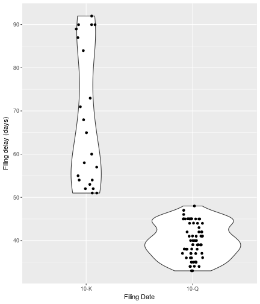
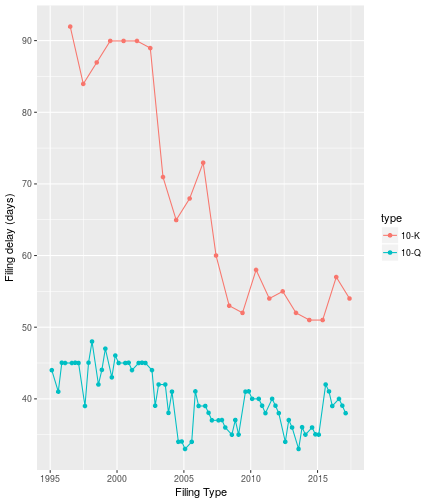
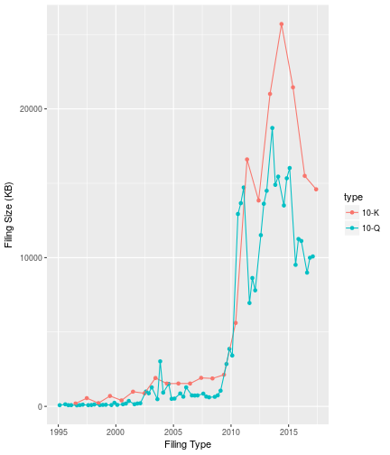

There are plenty of packages for R that allow for fetching and manipulation of
companies' financial data, often fetching that direct from public filings with
the SEC. All of these packages have the goal of getting to the XBRL data,
containing financial statements, typically in annual (10-K) or quarterly (10-Q)
filings.

SEC filings however contain far more information. edgarWebR is the first step
in accessing that data by providing an interface to the SEC EDGAR search tools
and the metadata they provide.

## Current Features
 * Search for companies and mutual funds.
 * List filings for a company or mutual fund.
 * Get all information associated with a particular filing

## Simple Usecase
Using information about filings, we can use edgarWebR to see how long after the
close of a financial period it takes for a company to make a filing. We can
also see how that time has changed.

### Get Data
First, we'll fetch a bunch of 10-K and 10-Q filings for our given company using
`company_filings()`. To make sure we're going far enough back we'll take a peak
at the tail of our results

```r
ticker <- "EA"

filings <- company_filings(ticker, type="10-", count=100)
initial_count <- nrow(filings)
# Specifying the type provides all forms that start with 10-, so we need to
# manually filter.
filings <- filings[filings$type == "10-K" | filings$type == "10-Q",]
```

Note that explicitly filtering caused us to go from 93 to
89 rows.


```r
filings$md_href <- paste0("[Link](", filings$href, ")")
knitr::kable(tail(filings)[,c("type", "filing_date", "accession", "size",
                              "md_href")],
             col.names=c("Type", "Filing Date", "Accession No.", "Size", "Link"),
             digits = 2,
             format.args = list(big.mark=","))
```


|   |Type |Filing Date |Accession No.        |Size   |Link                                                                                   |
|:--|:----|:-----------|:--------------------|:------|:--------------------------------------------------------------------------------------|
|87 |10-Q |1996-08-14  |0000950005-96-000615 |72 KB  |[Link](https://www.sec.gov/Archives/edgar/data/712515/0000950005-96-000615-index.html) |
|88 |10-K |1996-07-01  |0000912057-96-013563 |197 KB |[Link](https://www.sec.gov/Archives/edgar/data/712515/0000912057-96-013563-index.html) |
|89 |10-Q |1996-02-14  |0000912057-96-002551 |85 KB  |[Link](https://www.sec.gov/Archives/edgar/data/712515/0000912057-96-002551-index.html) |
|90 |10-Q |1995-11-14  |0000912057-95-009843 |83 KB  |[Link](https://www.sec.gov/Archives/edgar/data/712515/0000912057-95-009843-index.html) |
|91 |10-Q |1995-08-10  |0000912057-95-006218 |142 KB |[Link](https://www.sec.gov/Archives/edgar/data/712515/0000912057-95-006218-index.html) |
|93 |10-Q |1995-02-13  |0000912057-95-000644 |83 KB  |[Link](https://www.sec.gov/Archives/edgar/data/712515/0000912057-95-000644-index.html) |

We've received filings dating  back to 1995 which seems good enough for our
purposes, so next we'll get the filing information for each filing.

So far we've done everything in base R, but now we'll use some useful functions
from dplyr and purrr to make things a bit easier.

```r
# this can take a while - we're fetching ~100 html files!
filing_infos <- map_df(filings$href, filing_information)

filings <- bind_cols(filings, filing_infos)
filings$filing_delay <- filings$filing_date - filings$period_date

# Take a peak at the data
knitr::kable(head(filings) %>% select(type, filing_date, period_date,
                                      filing_delay, documents, filing_bytes) %>% 
             mutate(filing_delay = as.numeric(filing_delay)),
             col.names=c("Type", "Filing Date", "Period Date", "Delay",
                         "Documents", "Size (B)"),
             digits = 2,
             format.args = list(big.mark=","))
```


|Type |Filing Date |Period Date | Delay| Documents|   Size (B)|
|:----|:-----------|:-----------|-----:|---------:|----------:|
|10-K |2017-05-24  |2017-03-31  | 54.00|       127| 14,944,223|
|10-Q |2017-02-07  |2016-12-31  | 38.00|        89| 10,322,322|
|10-Q |2016-11-08  |2016-09-30  | 39.04|        89| 10,233,460|
|10-Q |2016-08-09  |2016-06-30  | 40.00|        89|  9,207,799|
|10-K |2016-05-27  |2016-03-31  | 57.00|       133| 15,865,077|
|10-Q |2016-02-08  |2015-12-31  | 39.00|        97| 11,389,536|

### Basic Analysis
Now our data is arranged, we can run some summary statistics and plot using
ggplot2.

```r
knitr::kable(filings %>%
             group_by(type) %>% summarize(
               n=n(),
               avg_delay = as.numeric(mean(filing_delay)),
               median_delay = as.numeric(median(filing_delay)),
               avg_size = mean(filing_bytes / 1024),
               avg_docs = mean(documents)
             ),
             col.names=c("Type", "Count", "Avg. Delay", "Median Delay",
                         "Avg. Size", "Avg. Docs"),
             digits = 2,
             format.args = list(big.mark=","))
```


|Type | Count| Avg. Delay| Median Delay| Avg. Size| Avg. Docs|
|:----|-----:|----------:|------------:|---------:|---------:|
|10-K |    22|      67.98|        62.48|  6,848.91|     22.18|
|10-Q |    67|      40.04|        40.00|  4,357.80|     13.12|

No surprise, yearly filings (10-K's) are larger and take more time than
quarterly filings (10-K's). Lets see how the times are destributed:


```r
ggplot(filings, aes(x = factor(type), y=filing_delay)) +
  geom_violin() + geom_jitter(height = 0, width = 0.1) +
  labs(x = "Filing Date", y = "Filing delay (days)")
#> Don't know how to automatically pick scale for object of type difftime. Defaulting to continuous.
```



We can also examine how the filing delay has changed over time:

```r
ggplot(filings, aes(x = filing_date, y=filing_delay, group=type, color=type)) +
  geom_point() + geom_line() +
  labs(x = "Filing Type", y = "Filing delay (days)")
#> Don't know how to automatically pick scale for object of type difftime. Defaulting to continuous.
```


Whether because of some internal change or change to SEC rules, the time
between the end of the fiscal year and the 10-K has dropped quite a bit, though
there is still a bit of variation.

An interesting extension would be to compare the filing delays to the company's
stock price, overall market performance and other companies to see if there are
particular drivers to the pattern.


```r
ggplot(filings, aes(x = filing_date, y=filing_bytes/1024, group=type, color=type)) +
  geom_point() + geom_line() +
  labs(x = "Filing Type", y = "Filing Size (KB)")
```


The jump in size ~2010 is the requirement for inclusion of financial datafiles
starting, but there is still interesting variations.

## More to come
The SEC contains a wealth of information and we're only scratching the surface.
edgarWebR itself has a lot more functionality than what we've explored here and
there is more coming.

## How to Download
edgarWebR is not yet of CRAN, as the API hasn't stabilized yet. In the
meantime, you can get a copy from github by using devtools:

```r
# install.packages("devtools")
devtools::install_github("mwaldstein/edgarWebR")
```
